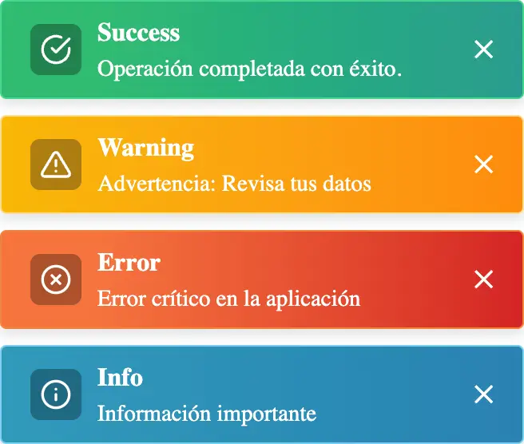
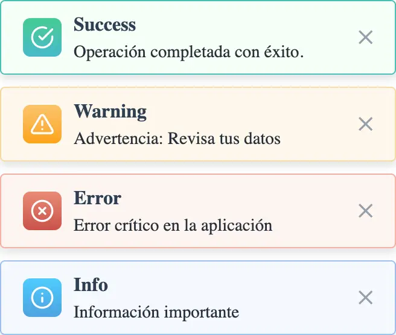
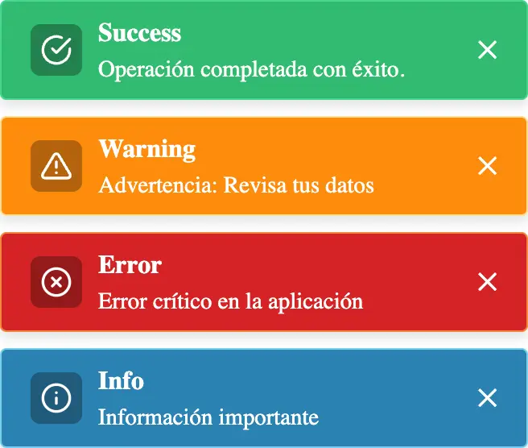

# Toast Kit

**Toast Kit** is a flexible and easy-to-use library for displaying toast notifications in the browser. It seamlessly integrates with any JavaScript framework and provides various styles and customization options.

## Installation

To get started, install **Toast Kit** via npm:

```bash
npm install toast-kit
```

## Basic Usage

You can quickly display toast messages using the `toastKit` method. Here's how to show different types of messages:

```javascript
import { toastKit } from "toast-kit";

toastKit.success({
    title: "Success",
    message: "Your operation was successful.",
});

toastKit.warning({
    title: "Warning",
    message: "This is a warning message.",
});

toastKit.error({
    title: "Error",
    message: "An error has occurred.",
});

toastKit.info({
    title: "Info",
    message: "This is an informational message.",
});
```

## Customization Options

Customize your toasts with a variety of options by passing an object to the `toastKit` method:

```javascript
import { toastKit, ToastStyle } from "toast-kit";

toastKit.success({
    title: 'Toast Title',
    message: 'Your custom message goes here.',
    duration: 5000,           // Duration of the toast in ms
    position: 'top-right',    // Position on the screen
    style: ToastStyle.solid,  // Available styles: solid, light, gradient
    border: true,             // Show border around the toast
    type: 'success'           // Toast type: success, warning, error, info
});
```

## Available Styles

Toast Kit offers multiple styles for your toast notifications:

### Style: Solid



### Style: Light



### Style: Gradient



## Available Options

| Option     | Type     | Default        | Description                                                                                                                           |
| ---------- | -------- | -------------- | ------------------------------------------------------------------------------------------------------------------------------------- |
| `title`    | `string` | `'Toast Title'` | The title of the toast message.                                                                                                       |
| `message`  | `string` | `'Write your message here.'` | The content of the toast message.                                                                                                      |
| `style`    | `string` | `'solid'`      | The style of the toast message. Options: `'solid'`, `'light'`, `'gradient'`.                                                           |
| `border`   | `boolean` | `true`         | Whether or not to display a border around the toast message.                                                                          |
| `type`     | `string` | `'info'`       | The type of the toast message. Options: `'success'`, `'warning'`, `'error'`, `'info'`.                                                |
| `duration` | `number` | `3000`         | The duration (in milliseconds) for which the toast message will be displayed.                                                         |
| `position` | `string` | `'top-right'`  | The position of the toast message. Options: `'top-right'`, `'top-left'`, `'bottom-right'`, `'bottom-left'`, `'top-center'`.           |

## Example Configurations

Here are some example configurations you can use:

- **Success Toast with Solid Style**:
    ```javascript
    toastKit.success({
        title: 'Success!',
        message: 'Your changes were saved.',
        style: ToastStyle.solid,
        duration: 4000,
        position: 'top-right',
    });
    ```

- **Error Toast with Gradient Style**:
    ```javascript
    toastKit.error({
        title: 'Error',
        message: 'Something went wrong.',
        style: ToastStyle.gradient,
        border: false,
        duration: 5000,
        position: 'bottom-left',
    });
    ```